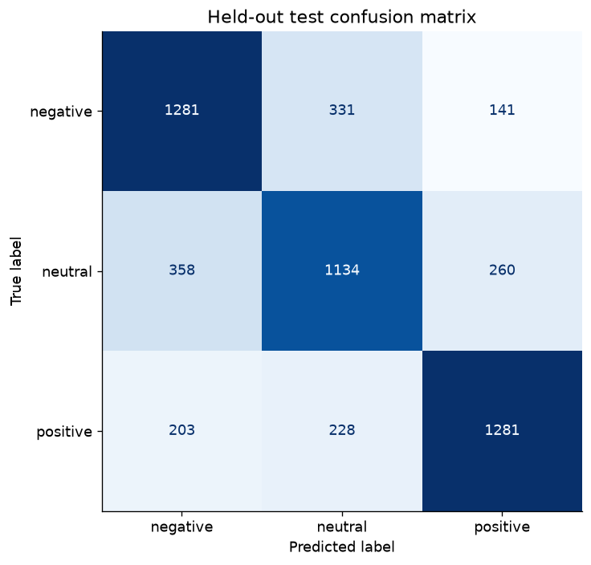

# Arabic Sentiment Classification with Word and Character Features

Developed an Arabic sentiment-classification pipeline with word and character TF-IDF features, duplicate checks and validation-based model selection. On a held-out set of 5,217 texts, the selected model achieved 70.85% accuracy and 0.709 macro F1, compared with 61.80% accuracy for an RBF-SVM baseline on the same split. Preserved negation and emoji and documented uncertainty in the source labels.

## Finding sentiment in Arabic spelling variation

A short Arabic post may mix spelling variants, negation, emoji and informal language. A small word vocabulary can miss useful clues. The question is whether combining word meaning with character patterns improves a reproducible sentiment baseline.

Normalization keeps negation and emoji; duplicate and conflicting texts are checked before splitting. Five models compete on validation macro F1, with the test set reserved for the final comparison.

Word and character features together improve held-out accuracy by 9.05 percentage points over the RBF-SVM baseline. The confusion matrix and confidence interval make the remaining errors visible; the source labels still need provenance verification.

## Status

Executed successfully; measured results saved.

## Method

Applied Arabic normalization while retaining negation and emoji. Removed conflicting duplicate labels and deduplicated normalized text before a stratified 60/20/20 split. Compared five word/character TF-IDF classifiers. Vocabulary and IDF weights are learned from training data only. Validation macro F1 selects the model; development data then trains the final model.

## Measured results

| Model | Accuracy | Balanced accuracy | Macro F1 | ROC-AUC |
|---|---:|---:|---:|---:|
| RBF-SVM baseline | 0.6180 | 0.6179 | 0.6183 | — |
| Word+character TFIDF + LogisticRegression | 0.7085 | 0.7088 | 0.7086 | — |


## Limits and interpretation

This is an internal benchmark on the supplied dataset; its label provenance is unverified. A random split is not proof of generalization to new authors, time periods, domains or dialects. The earlier notebook score used a different split and should not be treated as a controlled comparison.

## Data

Supply the original local Excel/CSV dataset with Text and Sentiment columns; labels must be negative, neutral or positive. Raw social-media text is excluded from this repository. Label origin and redistribution rights have not been independently verified.

## Reproduce

Run from this project directory in an isolated Python environment. The tabular projects were executed with Python 3.12; the deep-learning projects used Python 3.11 on CPU.

```shell
python -m venv .venv
# Activate .venv using your shell's activation command.
python -m pip install -r requirements.txt
python train.py --data data/arabic_tweets.xlsx --out results
```

`analysis.ipynb` is an executed results-review notebook. It displays saved outputs by default; its optional training cell can rerun the experiment after the dataset path is configured. Training scripts were executed separately to produce the recorded results. Raw datasets, downloaded encoders and trained model files are excluded from Git. Only load model files you created or trust.

## Files

- `train.py` or `analyze.py`: complete experiment or analysis.
- `common.py`: metric, figure and reproducibility helpers.
- `results/metrics.json`: measured outcomes, data fingerprint and environment.
- `results/*.csv` and `results/*.png`: aggregate tables and figures.
- `analysis.ipynb`: reproducible review and optional rerun instructions.
- `project-description.md`: LinkedIn-ready description and skills.

## Integrity checks and prediction

```shell
python -m unittest discover -p "test_*.py"
python predict.py --text "الخدمة جميلة والتجربة ممتازة"
```

Checks cover duplicate/conflicting-label split integrity and preservation of negation and emoji.

## Figures




## Attribution

Portfolio project by Nourah Alotaibi. This package refactors the collected project into a new reproducible workflow. Dataset providers, upstream libraries and pretrained-model authors retain their respective rights. This repository does not grant a new license to third-party data or models.

## Follow-up transformer comparison

The frozen transformer achieved 71.55% versus this model’s 70.85% on the same test rows. A paired check gives an accuracy-difference interval of −0.63 to +2.03 percentage points and p=0.312, so a reliable advantage is not established. See [the paired comparison, plot and counts](https://github.com/Nourah-Alotaibi/ai-data-science-portfolio/tree/main/10-arabic-transformers).
